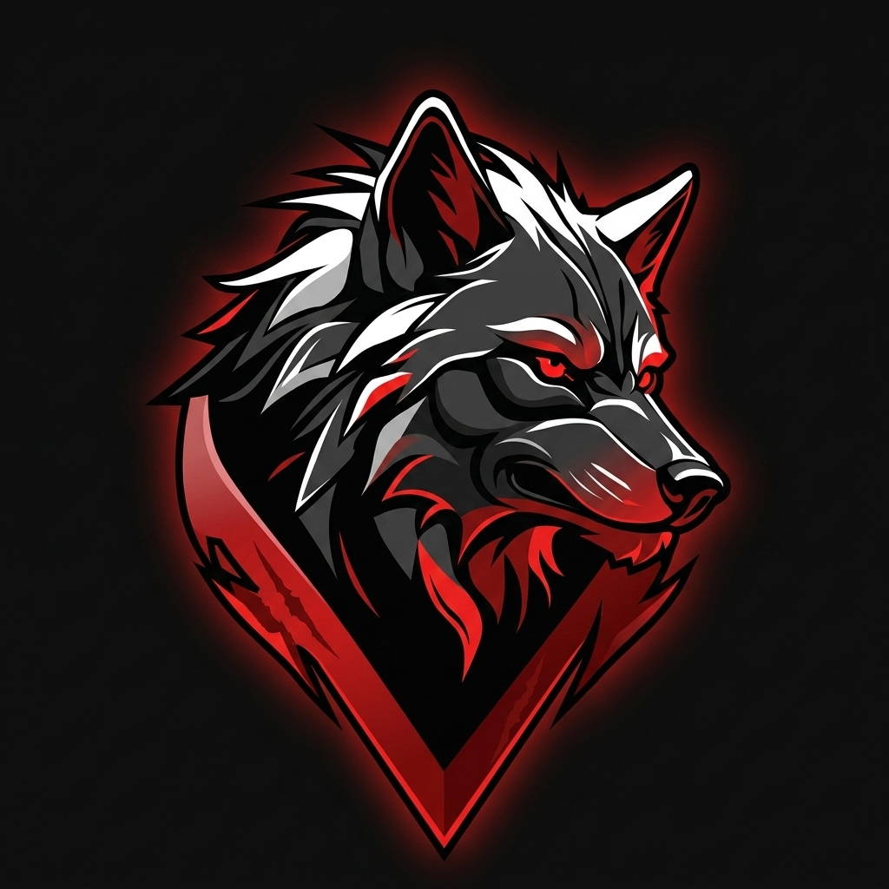

# 

<div align="center">
  
</div>

<div align="center">
  
</div>

<div align="center">
  
[%3B;Loading+Elite+Developer+Profile...;%3E+Architecting+the+Future+of+Software;%3E+Mastering+AI+%2B+Web3+%2B+Cloud;%3E+Status:+ONLINE)] (https://git.io/typing-svg)

</div>

<!-- ═══════════════════ ANIMATED DIVIDER ═══════════════════ -->


<!-- ═══════════════════ PROFILE BADGES ═══════════════════ -->

<div align="center">


&nbsp;

&nbsp;

&nbsp;


</div>

---

## ⚡ **MISSION CRITICAL: PROFILE STATUS**

<table>
<tr>
<td width="55%">

### 💫 **Neural Link Established**

**🚀 Greetings, Cyber-Traveller.** I am **RedWolf**, an **Elite Full-Stack Architect & AI Specialist** operating out of **Birmingham City University, UK**.

I don't just write code; I weave digital realities. My mission is to dismantle complex problems and reassemble them into elegant, scalable, and high-performance solutions. From the depths of backend infrastructure to the shimmering pixels of the frontend, I control the entire stack.

**🔥 Core Directives:**
- ⚡ **Hyper-Scale Architecture** — Building systems that withstand the digital tsunami
- 🧠 **Sentient AI** — Crafting reliable machine learning pipelines & models
- ☁️ **Cloud Sovereignty** — Dominating AWS, Azure, and GCP
- 🎨 **Neon UI/UX** — Designing interfaces that feel like the future
- 🔐 **Cyber Defense** — Writing secure, battle-tested code

**🌟 Philosophy:** *"The code you write today is the legacy you leave tomorrow."*

</td>
<td width="45%">

<div align="center">

### 🏆 **Trophy Case**
<a href="https://github.com/ryo-ma/github-profile-trophy">
  
</a>

</div>

</td>
</tr>
</table>

---

## 🎯 **QUICK INTEL**

<div align="center">

```yaml
name: RedWolf
location: Birmingham, UK 🇬🇧
education: Birmingham City University
role: Full-Stack Architect & AI Specialist
currently_working_on: AI-powered web applications & cloud-native systems
currently_learning: ["Rust", "Web3 / Blockchain", "Advanced System Design", "LLMs & Prompt Engineering"]
looking_to_collaborate: Open-source projects, AI/ML research, innovative startups
ask_me_about: React, Node.js, Python, Cloud Architecture, System Design, AI/ML
fun_fact: "I debug code in my dreams and wake up with the fix"
motto: "Ship fast, break nothing, scale everything"
```

</div>

---

## 🛠️ **ARSENAL: TECHNOLOGY MATRIX**

<div align="center">

### **🎨 FRONTEND: NEON INTERFACES**
<a href="https://skillicons.dev">
  
</a>

### **⚡ BACKEND: CORE RUNTIMES**
<a href="https://skillicons.dev">
  
</a>

### **🗄️ STORAGE: DATA ARCHITECTURE**
<a href="https://skillicons.dev">
  
</a>

### **☁️ CLOUD: SYSTEM DEPLOYMENT**
<a href="https://skillicons.dev">
  
</a>

### **🧠 AI: SENTIENT ALGORITHMS**
<a href="https://skillicons.dev">
  
</a>


### **🔧 TOOLS: DEVELOPMENT RIG**
<a href="https://skillicons.dev">
  
</a>

### **🧪 QUALITY: BATTLE-TESTED CODE**


</div>

<!-- ═══════════════════ ANIMATED DIVIDER ═══════════════════ -->


---

## 📊 **SYSTEM ANALYTICS**

<div align="center">

<table>
<tr>
<td width="50%" align="center">

### **🔥 Streak Status**
<a href="https://git.io/streak-stats">
  
</a>

</td>
<td width="50%" align="center">

### **⚡ Code Frequency**


</td>
</tr>
</table>

<table>
<tr>
<td width="50%" align="center">

### **💻 Language Dominance**


</td>
<td width="50%" align="center">

### **📊 Profile Summary**


</td>
</tr>
</table>

### **📈 Contribution Activity Graph**


### **🏔️ 3D Contribution Calendar**


</div>

---

## 📈 **GITHUB METRICS**

<div align="center">


<!-- Metrics will be generated by the github-metrics workflow. If not set up yet, this will show a broken image. -->

</div>

---

## 🚀 **FEATURED PROJECTS**

<div align="center">

<a href="https://github.com/Mathiyass/Mathiyass">
  
</a>
<a href="https://github.com/Mathiyass/MA-Optimizer">
  
</a>
<a href="https://github.com/Mathiyass/MAportfolio">
  
</a>
<a href="https://github.com/Mathiyass/MA_Chat">
  
</a>

</div>

> 💡 *Pin your best repositories on your GitHub profile and duplicate the card template above for each repo!*

---

## 🎵 **NOW VIBING TO**

<div align="center">

<!-- 
To enable LIVE Spotify Now Playing:
1. Deploy: https://github.com/kittinan/spotify-github-profile
2. Replace the placeholder below with your widget URL

Example:


-->

<br/>

[](https://open.spotify.com/user/mathiya)
[](https://music.apple.com/)

</div>

---

## 📡 **DYNAMIC DATA STREAMS**

<table width="100%">
<tr>
<td width="50%">

### 📺 **Latest YouTube Transmissions**
<!-- YOUTUBE:START -->
- [Obstacle avoiding Robot](https://www.youtube.com/watch?v=eYGoyt9z1z8)
- [Building a 2D sprites animation game using pure HTML, CSS, and JavaScriptLanguages](https://www.youtube.com/watch?v=jO4Bg3zOlVs)
- [New Minecraft 2 playing](https://www.youtube.com/watch?v=fm57QLnm4TA)
- [HOW TO ADD NEW CARS ON NFS MOST WANTED 2005](https://www.youtube.com/watch?v=maOHZsjQBAk)
<!-- YOUTUBE:END -->

</td>
<td width="50%">

### 📝 **Latest Neural Logs (Blog)**
<!-- BLOG-POST-LIST:START -->
- [Waiting for uplink...](https://medium.com/@mathishaangirasa)
- [Waiting for uplink...](https://medium.com/@mathishaangirasa)
- [Waiting for uplink...](https://medium.com/@mathishaangirasa)
- [Waiting for uplink...](https://medium.com/@mathishaangirasa)
- [Waiting for uplink...](https://medium.com/@mathishaangirasa)
<!-- BLOG-POST-LIST:END -->

</td>
</tr>
</table>

---

## ⚡ **RECENT NETWORK ACTIVITY**

<!--START_SECTION:activity-->
1. 🔒 Closed issue [#27](https://github.com/Mathiyass/MAportfolio/issues/27) in [Mathiyass/MAportfolio](https://github.com/Mathiyass/MAportfolio)
2. 🔒 Closed issue [#26](https://github.com/Mathiyass/MAportfolio/issues/26) in [Mathiyass/MAportfolio](https://github.com/Mathiyass/MAportfolio)
<!--END_SECTION:activity-->

---

## 📊 **WEEKLY CODING STATS**

<!--START_SECTION:waka-->
```text
🕐 No WakaTime data yet — Set up WakaTime to track your coding stats!
   → https://wakatime.com to get started
   → Then add the waka-readme-stats workflow
```
<!--END_SECTION:waka-->

---

## 💡 **RANDOM DEV WISDOM**

<div align="center">

[](https://github.com/piyushsuthar/github-readme-quotes)

</div>

---

## 🏅 **CERTIFICATIONS & ACHIEVEMENTS**

<div align="center">

<!-- Replace with your actual certifications. Here are badge templates: -->


> 💡 *Update these with your actual certifications!*

</div>

---

## 🧩 **CODING CHALLENGES**

<div align="center">

<!-- Replace the username placeholders with your actual usernames -->

[](https://leetcode.com/u/mathiya/)
[](https://www.hackerrank.com/profile/mathiya)
[](https://www.codewars.com/users/mathiya)
[](https://www.codechef.com/users/mathiya)

<!-- If you have a LeetCode account, uncomment and update this:

-->

</div>

---

## 🃏 **DEV_HUMOR.EXE**

<div align="center">


</div>

---

## 🌍 **CONNECT TO THE GRID**

<div align="center">

[](https://github.com/Mathiyass)
[](https://linkedin.com/in/mathisha-angirasa-a955941a2/)
[-000000?style=for-the-badge&logo=x&logoColor=white&color=FF0000&labelColor=000000)](https://x.com/M_Methsara_RW)
[](https://www.instagram.com/muditha_methsara)
[](https://discord.com)
[](https://wa.me/94726125275)
[](https://mudithamethsara.github.io/muditha_methsara/)
[](https://youtube.com/@mathiya1783)
[](https://medium.com/@mathishaangirasa)
[](https://dev.to/mathishaangirasa)
[](https://stackoverflow.com/users/mathiya)
[](mailto:YOUR_EMAIL_HERE)

</div>

---

## 💖 **SUPPORT MY WORK**

<div align="center">

*If you enjoy my projects and want to fuel the mission, consider dropping some support! 🚀*

[](https://buymeacoffee.com/mudithamethsara)
[](https://ko-fi.com/mudithamethsara)
[](https://github.com/sponsors/Mathiyass)

</div>

---

<!-- ═══════════════════ ANIMATED DIVIDER ═══════════════════ -->


<div align="center">

### **🐍 Snake Protocol — Contribution Grid**
<picture>
  <source media="(prefers-color-scheme: dark)" srcset="https://raw.githubusercontent.com/Mathiyass/Mathiyass/output/github-snake-dark.svg" />
  <source media="(prefers-color-scheme: light)" srcset="https://raw.githubusercontent.com/Mathiyass/Mathiyass/output/github-snake.svg" />
  
</picture>

### **👾 Pacman Protocol — Contribution Grid**


<br/>


### 🕐 **Last Updated**


### **`> END_TRANSMISSION_`**
<div align="center">
  
</div>

</div>
