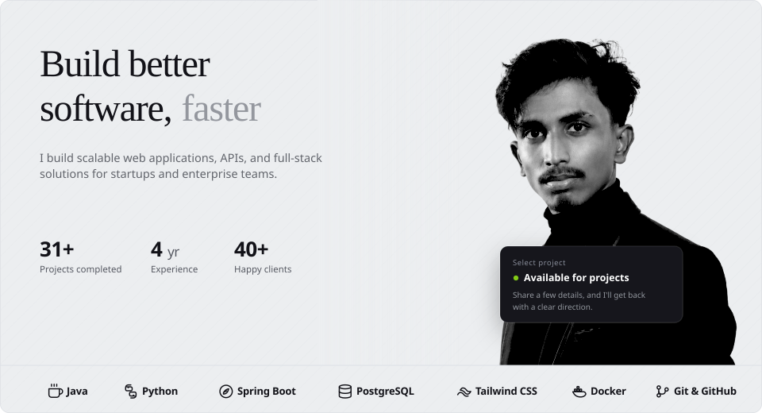

  

  
  
  
  
  

---

### About Me

Great software starts with clear thinking. I am a **Professional Developer and Software Engineer** from Sri Lanka specializing in building scalable web applications, robust backend architectures, distributed APIs, and full-stack digital systems shaped by clean architecture, comprehensive test coverage, and thoughtful execution.

In addition to engineering engagements, I hold executive and leadership positions driving technology strategy and production delivery:
- **Chief Operating Officer (COO)** at [SIVION AI](https://sivions.com) — Directing AI product lifecycles, operational scaling, and intelligent system workflows.
- **Production Director** at [CodeXpro Solutions](https://codexpro.net) — Leading software engineering lifecycles, system architecture standards, and client delivery pipelines.

📍 **Location:** Gampaha, Sri Lanka • Remote Worldwide  
⚡ **Core Focus:** React, TypeScript, Node.js, Spring Boot, Java, Cloud Architecture, REST APIs & Microservices

---

### Tech Stack &amp; Engineering Tooling

  <strong>Languages</strong> 
  
  
  
  
  
  
  

  <strong>Frontend &amp; Mobile</strong> 
  
  
  
  
  
  

  <strong>Backend, APIs &amp; Architecture</strong> 
  
  
  
  
  
  
  

  <strong>Databases, Cloud &amp; DevOps</strong> 
  
  
  
  
  
  

---

### GitHub Analytics &amp; Repository Stats

  
  

  

---

### Contribution Activity

  <picture>
    <source media="(prefers-color-scheme: dark)" srcset="https://raw.githubusercontent.com/MudithaMethsara/MudithaMethsara/output/github-contribution-grid-snake-dark.svg" />
    <source media="(prefers-color-scheme: light)" srcset="https://raw.githubusercontent.com/MudithaMethsara/MudithaMethsara/output/github-contribution-grid-snake.svg" />
    
  </picture>

---

### Featured Engineering Projects

<table>
  <tr>
    <td width="50%" valign="top">
      <h4>🏛️ Civitech System</h4>
      
A complete, production-ready construction management monorepo featuring an Express/Prisma backend API, an Electron desktop admin panel, and a responsive web resource monitor.

      

        
        
        
        
      

    </td>
    <td width="50%" valign="top">
      <h4>🏗️ Civitech Platform</h4>
      
High-performance enterprise construction platform built with Next.js 16 Server Components, dynamic service catalogs, animated interactive showcases, and MySQL database integration.

      

        
        
        
        
      

    </td>
  </tr>
  <tr>
    <td width="50%" valign="top">
      <h4>📱 MediGo Mobile</h4>
      
Cross-platform healthcare and medical appointment booking application built with React Native 0.81, Expo Router, and NativeWind styling for smooth mobile performance.

      

        
        
        
        
      

    </td>
    <td width="50%" valign="top">
      <h4>⚙️ Hexcore Engine</h4>
      
High-throughput enterprise backend framework providing core system utilities, service bus communication, robust dependency injection, and clean architecture.

      

        
        
        
        
      

    </td>
  </tr>
</table>

---

### Connect &amp; Collaborate

  
  
  
  
  

---

  Built with precision, clarity, and solid architecture &bull; &copy; 2026 Muditha Methsara Kosgollawaththa &bull; <a href="https://methsara.dev">methsara.dev</a>

